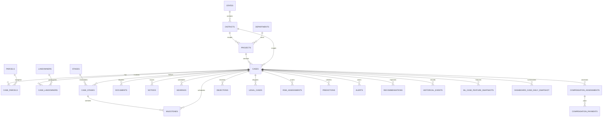

# Land Acquisition Delay Analytics Database

This schema targets PostgreSQL 15+ and is designed for transactional correctness,
temporal analysis, explainable risk prediction, and future replacement of demo
data with government data. The source-of-truth tables are normalized. The two
projection tables at the end are rebuildable and must never be edited as if they
were authoritative case records.

## Table catalog

| Table | Purpose | Primary key | Main relationships |
|---|---|---|---|
| `states` | State master data | `state_id` | Parent of districts and projects |
| `districts` | District master data | `district_id` | Belongs to a state; scopes projects, cases, parcels, officers |
| `departments` | Departments and hierarchy | `department_id` | Own projects, stages, alerts, recommendations |
| `officers` | Authorized users and assignees | `officer_id` | Belongs to a department; assigned to cases, stages, milestones |
| `land_acquisition_projects` | Project scope and target | `project_id` | Belongs to state, district, and owning department; has cases |
| `acquisition_cases` | Operational acquisition case | `case_id` | Belongs to a project; points to its current `case_stages` row |
| `parcels` | Physical land units | `parcel_id` | Scoped to a district; linked through `case_parcels` |
| `case_parcels` | Case-to-parcel bridge | `(case_id, parcel_id)` | Tracks unresolved/resolved parcels |
| `landowners` | Landowner or affected-party master | `landowner_id` | Linked through case relationships and documents |
| `case_landowners` | Case-to-landowner bridge | `(case_id, landowner_id)` | Counts affected owners and affected area |
| `acquisition_stages` | Workflow stage dictionary | `stage_id` | Instantiated by `case_stages` |
| `case_stages` | Temporal stage instance | `case_stage_id` | Planned/actual timestamps and ownership |
| `milestones` | Case/stage deadlines | `milestone_id` | Links case, stage, department, officer |
| `documents` | Required and submitted evidence | `document_id` | Case, optionally parcel/owner |
| `notices` | Statutory and administrative notices | `notice_id` | Case and optionally landowner |
| `hearings` | Scheduled/completed hearings | `hearing_id` | Case and optionally notice |
| `compensation_assessments` | Assessed/approved compensation | `assessment_id` | Case, optionally parcel/owner |
| `compensation_payments` | Payment schedules/outcomes | `payment_id` | Belongs to an assessment |
| `objections` | Objections and resolution | `objection_id` | Case and optionally owner/notice |
| `legal_cases` | Court and legal disputes | `legal_case_id` | Case and optionally parcel/owner |
| `risk_assessments` | Rule, ML, combined, or manual risk | `risk_assessment_id` | Append-only assessments for a case |
| `predictions` | Versioned ML outputs | `prediction_id` | Probability, duration, snapshot, explanation |
| `prediction_explanations` | Immutable explanation envelope | `explanation_id` | One-to-one with a prediction |
| `prediction_factors` | Ranked local ML/rule factors | `factor_id` | Prediction, optional rule evaluation |
| `model_feature_importance` | Global model importance by cohort | `(model_version, feature_code, importance_method, cohort)` | Belongs to a model version |
| `alerts` | Early warnings/escalation queue | `alert_id` | Case and optionally milestone |
| `recommendations` | Preventive/corrective actions | `recommendation_id` | Case and optionally alert |
| `prediction_recommendations` | Prediction-to-action bridge | `(prediction_id, recommendation_id)` | Orders actions for a prediction |
| `historical_events` | Append-only domain timeline | `event_id` | Case/project event stream |
| `audit_logs` | Immutable change/security trail | `audit_id` | Actor, operation, old/new values |
| `ml_case_feature_snapshots` | Point-in-time ML feature store | `snapshot_id` | Case and prediction cutoff |
| `dashboard_case_daily_snapshot` | Dashboard aggregate projection | `(snapshot_date, case_id)` | Rebuildable daily metrics |

## Temporal design

The schema stores planned and actual timestamps. For a stage:

```text
stage_duration_days = actual_end_at - actual_start_at
current_stage_age_days = now() - actual_start_at
planned_variance_days = actual_end_at - planned_end_at
```

For an active stage, `actual_end_at` is null. For historical reconstruction, use
`historical_events.occurred_at`, not `recorded_at`; the latter captures late data
entry and supports audit and data-quality analysis. ML feature snapshots are
generated using an `as_of_at` cutoff so future events cannot leak into training.

The database uses valid-time fields for business facts and transaction-time fields
such as `created_at`, `updated_at`, and `recorded_at` for system history. If legal
requirements later demand full bitemporal correction history, add system-versioned
history tables or temporal partitions without changing operational keys.

## ER diagram



## Integrity rules

1. A completed stage must have `actual_end_at`; a blocked stage must have a reason.
2. A completed case must have `closed_on`.
3. At most one stage may be active for a case; `current_case_stage_id` is maintained
    with the active stage by the application transaction.
4. Date ordering must be valid for notices, hearings, objections, legal matters,
   payments, stages, and compensation approvals.
5. Case, parcel, owner, and department scope must be checked in the service layer
   or with deferred database constraints where cross-table consistency matters.
6. A prediction stores model version, prediction time, horizon, input snapshot, and
   explanation together. Never overwrite a prediction.
7. Risk history is append-only; the current risk is the latest record.
8. `data_origin` is mandatory on source-bearing records and must be visible in reports.
9. Cases should be archived rather than physically deleted in normal operations.
10. Feature snapshots are point-in-time records; future events cannot form features.
11. Operational totals are calculated from source tables; dashboard snapshots are
    cacheable projections only.

## Analytical projections

`ml_case_feature_snapshots` avoids repeatedly scanning stage, milestone, legal,
objection, and compensation tables during training or prediction. It includes the
feature version and cutoff timestamp so feature definitions remain reproducible.

`dashboard_case_daily_snapshot` supports fast executive, district, and historical
trend dashboards. A scheduled job rebuilds or upserts it from source tables. It is
not used to correct source records.

## Audit strategy

Use application-generated audit records for every mutation, including actor, request
ID, source IP, reason, old values, and new values. Add database triggers for defense
in depth on cases, case stages, compensation, legal cases, risk assessments,
predictions, alerts, and recommendations. Keep audit tables append-only for normal
application roles, partition them by month at scale, encrypt PII fields, and restrict
access to auditors and administrators. Domain events explain what happened in the
workflow; audit logs explain who changed data and through which request.

## Deployment note

The migration enables PostGIS because `parcels.geometry` and its GiST index use
spatial types. If spatial search is intentionally excluded from the first
deployment, remove the `postgis` extension statement, the geometry column, and
the GiST index together. All other tables use standard PostgreSQL features.