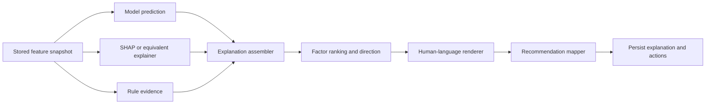

# Explainable AI Architecture

The explanation service converts one prediction into an evidence-backed decision
brief. It never returns an unexplained percentage and never describes association
as causation.

## Officer-facing explanation contract

For every prediction the service returns:

- Risk level and calibrated delay probability.
- Expected delay and uncertainty interval.
- Confidence band and data-quality warnings.
- Ranked factors increasing risk.
- Ranked mitigating factors.
- Direction and signed/relative contribution.
- Human-readable, non-causal explanation.
- Recommended action, responsible department, priority, and rationale.
- Model, calibration, feature, and policy versions.
- Known limitations.

Recommended language:

> Current stage age is associated with higher predicted delay risk. The stage is
> 34 days beyond its configured schedule baseline.

Avoid:

> The stage caused the delay.

The first statement reports model evidence. The second claims causality that the
observational prediction system has not established.

## Local explanation pipeline



### SHAP values

For a tree model, use TreeSHAP with the exact deployed model and the same feature
transformation used during inference. For linear models, use coefficient times the
transformed feature difference from the baseline. For models without a native
explainer, use a documented KernelSHAP or permutation method with a fixed background
dataset and a recorded explainer version.

For a probability model, a local explanation contains:

```text
baseline_probability = expected model output for the background population
local_prediction     = model output for this case
signed_contribution  = factor contribution in the model output space
```

The explanation service must verify that the baseline plus contributions reconcile
with the model output within a configured numerical tolerance. If the model uses a
log-odds explanation space, state that explicitly and transform only for display;
do not mix log-odds and probability contributions as if they were interchangeable.

### Factor ranking

Rank by absolute signed contribution, then apply these controls:

1. Collapse duplicate encoded columns into one human feature.
2. Group correlated features where a single operational issue creates multiple
   technical columns.
3. Add rule factors that are not represented in the model.
4. Mark whether a factor comes from `ML`, `RULE`, or both.
5. Show at most five primary factors by default, with an expandable full view.

`relative_contribution` is:

```text
abs(signed_contribution_i) / sum(abs(signed_contribution_j))
```

It is a relative explanation quantity, not the probability that the factor caused
the delay and not a percentage of the final delay.

## Direction and visual semantics

The API stores a direction enum. The UI maps it consistently:

| Direction | Display color | Meaning |
|---|---|---|
| `INCREASES_RISK` | RED | Associated with a higher predicted delay risk |
| `NEUTRAL` or low-confidence evidence | YELLOW | Requires attention or has limited interpretability |
| `REDUCES_RISK` | GREEN | Associated with lower predicted delay risk or active mitigation |

Color must never be the only signal. Each factor also displays its direction text,
label, magnitude, and evidence. Red is not an accusation against an officer or
department; it identifies a model/rule signal for intervention.

## Human-readable factor rendering

The renderer uses a controlled feature dictionary rather than arbitrary model text.
Each feature definition contains:

```json
{
  "featureCode": "STAGE_OVERDUE_DAYS",
  "label": "Current stage overdue",
  "unit": "days",
  "directionTemplate": "Current stage age is associated with higher predicted delay risk.",
  "actionTemplate": "Review the stage bottleneck and assign an owner for the overdue activity."
}
```

The renderer fills measured values, comparison baselines, timestamps, and policy
thresholds. It must refuse to render a causal verb such as `caused`, `resulted in`,
or `will lead to` unless a separately approved causal analysis is being displayed.

Example factor output:

```json
{
  "factorCode": "STAGE_OVERDUE_DAYS",
  "label": "Current stage overdue by 34 days",
  "direction": "INCREASES_RISK",
  "displayColor": "RED",
  "relativeContribution": 0.31,
  "explanation": "The current stage is 34 days beyond its configured schedule baseline, which is associated with higher predicted delay risk.",
  "recommendedAction": "Review the stage bottleneck and assign an accountable department officer.",
  "evidenceAt": "2026-09-15T09:00:00Z"
}
```

## Recommendation generation

Recommendations are mapped from evidence codes, not generated as unsupported free
text. Each mapping contains an owner, priority rule, expected evidence, and due-date
policy.

| Evidence | Recommended action |
|---|---|
| `OWNERSHIP_UNRESOLVED` | Prioritize ownership verification for unresolved parcels |
| `OPEN_OBJECTION_COUNT` | Schedule pending hearings and assign objection review |
| `COMPENSATION_PENDING_DAYS` | Escalate compensation cases older than departmental SLA |
| `MILESTONE_SLIPPAGE_COUNT` | Assign additional officers or hold a corrective project review |
| `MISSING_DOCUMENT_COUNT` | Complete the missing-document checklist and verify submissions |
| `ACTIVE_STAY_ORDER` | Escalate to the legal department; do not recommend action contrary to the order |
| `PENDING_APPROVAL_COUNT` | Route the approval queue to the authorized decision-maker |

An action is only created when its evidence is present at prediction time. A rule
may create an operational alert even if the ML score is unavailable. Recommendations
remain suggestions; authorized officials accept, edit, assign, or dismiss them.

## Global explanations

Global importance describes what the deployed model tends to use across a population,
not what caused outcomes. Compute and store:

- Mean absolute SHAP value by feature.
- Mean signed SHAP value by feature.
- Permutation importance on a time-separated validation set.
- Importance rank and model version.
- Cohort values for state, district, department, project type, and data origin.

The dashboard should show the top global features with a definition, measurement
window, data coverage, and a warning that importance is associational. Never use
global importance to state that a department or district causes delay.

Global importance must be monitored for instability. A feature is not promoted to
an official explanation dictionary if its importance changes sharply across folds,
has poor availability, or is a known proxy for a protected attribute without
governance approval.

## Confidence and limitations

Confidence is a reliability indicator, separate from delay probability. The service
should lower confidence when:

- Required features are missing or stale.
- The case is outside the training population.
- The prediction interval is wide.
- Calibration error is high in the relevant band.
- District/project-type support is weak.
- A rule override determines the final risk level.
- The result is rule-only or based on a stale ML prediction.

Every explanation must include limitations such as:

- “This is a predictive association, not a causal finding.”
- “The result depends on the completeness and freshness of recorded case data.”
- “The model has limited historical support for this project type.”
- “The final risk category was escalated by a policy rule.”

## Backend endpoints

```http
GET /api/v1/cases/{caseId}/predictions/{predictionId}/explanation
GET /api/v1/cases/{caseId}/predictions/{predictionId}/factors
GET /api/v1/models/{modelVersion}/feature-importance
GET /api/v1/cases/{caseId}/recommendations?predictionId={predictionId}
```

The explanation endpoint reads the immutable prediction, normalized factors,
confidence envelope, rule evaluations, and recommendation links. It must not
recompute an explanation with the currently active model, because that would make
historical screens change without a new prediction.

## Testing and governance

- Unit-test contribution sign, rank ordering, color mapping, and recommendation
  evidence requirements.
- Test SHAP additivity or equivalent reconciliation within tolerance.
- Test that missing data lowers confidence and is surfaced to the officer.
- Test that causal wording is rejected by the controlled renderer.
- Test explanations against known synthetic scenarios.
- Compare explanations across model versions during shadow deployment.
- Audit access to explanations because they may expose sensitive case details.
- Require human review for critical escalation and all statutory decisions.