# Land Acquisition Delay Prediction Dataset

This document defines the model-ready dataset for the three requested outputs:

1. `delay_probability`: probability that a case experiences a significant delay.
2. `expected_additional_delay_days`: expected additional delay duration.
3. `risk_category`: `LOW`, `MEDIUM`, `HIGH`, or `CRITICAL`.

The design is point-in-time. A training row represents what was knowable about a
case at one prediction timestamp, not a summary of the case after it finished.
The operational source is PostgreSQL; the canonical feature snapshot is
`ml_case_feature_snapshots`.

## 1. Prediction contract

### Prediction unit

The unit is one `(case_id, as_of_at, prediction_horizon_days)` row. A case can
therefore have many rows over its lifecycle, such as one daily snapshot or one
snapshot whenever a material event occurs. Rows from the same case must never be
split across train and validation/test sets.

### Recommended initial label policy

The policy must be configurable by workflow or legal regime. The initial demo
configuration may define:

```text
significant_delay = 1 when:
    final_completion_date > approved_target_date + delay_tolerance_days
    OR final_delay_days >= significant_delay_days
    OR a statutory deadline breach is confirmed
```

`delay_tolerance_days` and `significant_delay_days` are policy configuration, not
claimed government statistics. Store the label policy version with every dataset
row. Do not label an active case as non-delayed merely because it has not yet
finished.

### Target 1: delay probability

Binary outcome after the prediction horizon or final case completion:

```text
y_delay = 1 if significant delay occurs
y_delay = 0 if the case completes within the allowed schedule
```

Cases still active at the label cutoff are right-censored. For a basic classifier,
exclude unresolved censored rows from final-label training and report coverage. For
the preferred time-to-event approach, retain them with an event flag and censoring
time.

### Target 2: expected additional delay days

Recommended definition:

```text
actual_or_projected_delay_days = max(0, final_completion_date - approved_target_date)
additional_delay_from_snapshot = max(0, final_completion_date - as_of_at)
```

The service should return both `expected_delay_days_from_target` and
`expected_remaining_delay_days`; the latter is more useful operationally. For
cases that finish on time, the target is zero. For active cases, duration is
censored and should be handled with survival or two-stage modelling rather than
inventing a final duration.

### Target 3: risk category

Risk category is a governed decision output, not an uncontrolled fourth label.
Initially derive it from calibrated delay probability and deterministic override
rules:

| Category | Starting probability band |
|---|---:|
| LOW | `< 0.25` |
| MEDIUM | `0.25` to `< 0.50` |
| HIGH | `0.50` to `< 0.75` |
| CRITICAL | `>= 0.75` |

These thresholds must be configuration and validated against intervention capacity.
A case can be escalated to `CRITICAL` by an explicit rule such as a confirmed stay
order or a breached statutory deadline. Persist the ML probability, rule score,
final category, threshold version, and override reason separately.

## 2. Dataset contract

Each feature snapshot should contain:

| Column | Type | Required |
|---|---|---|
| `snapshot_id` | UUID | Yes |
| `case_id` | UUID | Yes, identifier only |
| `project_id` | UUID | Yes, grouping only |
| `as_of_at` | Timestamp UTC | Yes |
| `prediction_horizon_days` | Integer | Yes |
| `feature_version` | String | Yes |
| `data_origin` | Enum | Yes |
| `label_policy_version` | String | Training rows only |
| `y_delay` | Binary | Training only |
| `label_delay_days` | Numeric | Training only |
| `censoring_flag` | Binary | Yes |
| `features` | Versioned JSON or flattened columns | Yes |

For production inference, labels are absent. Every inference request logs the
feature snapshot, model version, data freshness, and explanation in `predictions`.

## 3. Feature engineering catalogue

The following features are calculated using source rows with an event time no later
than `as_of_at`. Counts and durations are calculated as-of the snapshot, not from
the final case record.

### A. Project characteristics

| Feature | Why it matters | Type / encoding | Normalize | Missing / leakage risk |
|---|---|---|---|---|
| `project_type` | Workflow complexity differs by project type | Categorical; one-hot, native categorical, or target encoding fitted on train only | No for trees; yes for linear models after encoding | Unknown allowed; do not use a type assigned after completion |
| `project_size_area` | Larger scope creates more coordination | Numeric; `log1p` plus missing flag | Yes for linear models | Impute median by train fold; final measured area may leak |
| `parcel_count` | More parcels create more transactions | Integer numeric; `log1p` | Optional for trees; yes for linear | Missing only when source incomplete; do not use final parcel count if scope changed later |
| `affected_landowner_count` | More parties increase notice and objection work | Integer numeric; `log1p` | Optional for trees | Snapshot count only; final owner count leaks future discovery |
| `project_priority` | Priority controls escalation and resource allocation | Ordered categorical | No | Must be the priority known at snapshot time |
| `estimated_project_duration_days` | Provides schedule context | Numeric | Robust scaling for linear models | Must be original estimate, not actual duration |
| `acquisition_method` | Different procedures have different lead times | Categorical | No for trees | Do not derive from final legal outcome |

### B. Administrative factors

| Feature | Why it matters | Type / encoding | Normalize | Missing / leakage risk |
|---|---|---|---|---|
| `owning_department` | Captures process ownership | Categorical; one-hot or native categorical | No | Unknown category allowed; use department history only from prior cases |
| `current_department` | Identifies current queue and handoff | Categorical | No | Snapshot value only; current department after completion leaks |
| `responsible_officer_role` | Role type may affect workflow responsibility | Categorical | No | Prefer role/designation over officer identity |
| `responsible_officer_id` | May capture workload or historical performance | High-cardinality categorical or replace with workload aggregates | No | Do not use raw identity by default; possible proxy and fairness risk |
| `approval_stage_count` | More approvals imply more handoffs | Integer numeric | Optional | Count only known configured stages |
| `pending_approval_count` | Direct bottleneck signal | Integer numeric | Optional | Do not count approvals created after snapshot |
| `blocked_dependency_count` | Measures external coordination blockage | Integer numeric | Optional | Future-resolved dependency status is leakage |
| `department_open_case_load` | Approximates capacity pressure | Numeric; log transform | Yes for linear models | Calculate from cases opened before snapshot; exclude the current case where appropriate |
| `case_processing_time_days` | Measures elapsed operational age | Numeric; `log1p` | Yes for linear models | Valid only up to `as_of_at`; final processing time leaks |

### C. Landowner and ownership factors

| Feature | Why it matters | Type / encoding | Normalize | Missing / leakage risk |
|---|---|---|---|---|
| `landowner_count` | More parties increase coordination | Integer numeric; `log1p` | Optional | Snapshot count only |
| `ownership_complexity_score` | Captures joint ownership, heirs, and relationships | Numeric bounded score | Yes for linear models | Score must use only facts known at snapshot |
| `disputed_ownership_flag` | Title uncertainty delays resolution | Boolean | No | A dispute opened later cannot be used earlier |
| `unresolved_record_count` | Indicates land-record work remaining | Integer numeric | Optional | Do not derive from final resolution state |
| `unresolved_parcel_count` | Direct measure of remaining scope | Integer numeric | Optional | Use `case_parcels` state as of snapshot |
| `open_objection_count` | Indicates resistance or unresolved review | Integer numeric; `log1p` | Optional | Future objections are leakage |
| `oldest_open_objection_days` | Captures objection ageing | Numeric | Yes for linear models | Calculate from `received_at` to `as_of_at` only |

### D. Compensation factors

| Feature | Why it matters | Type / encoding | Normalize | Missing / leakage risk |
|---|---|---|---|---|
| `assessed_compensation_amount` | Larger financial exposure may need more approval | Numeric; `log1p`, currency-normalized | Yes | Use assessment known by snapshot |
| `approved_compensation_amount` | Indicates financial readiness | Numeric; `log1p` | Yes | Later approval is leakage |
| `paid_compensation_amount` | Indicates completed financial action | Numeric; `log1p` | Yes | Only payments recorded by snapshot |
| `pending_compensation_amount` | Direct unresolved financial obligation | Numeric; `log1p` | Yes | Never calculate from final total only |
| `compensation_approval_pending_flag` | Identifies a blocking state | Boolean | No | Snapshot state only |
| `average_payment_processing_days` | Historical payment speed | Numeric | Yes | Compute using prior completed payments, excluding current future outcomes |
| `payment_failure_count` | Indicates operational friction | Integer numeric | Optional | Failures must precede snapshot |

### E. Legal factors

| Feature | Why it matters | Type / encoding | Normalize | Missing / leakage risk |
|---|---|---|---|---|
| `open_legal_case_count` | Legal matters extend timelines | Integer numeric | Optional | Count open matters as of snapshot |
| `legal_dispute_flag` | Direct complexity signal | Boolean | No | A later-filed case is leakage |
| `stay_order_flag` | Can halt acquisition activity | Boolean | No | Use only an active order known at snapshot |
| `days_to_next_hearing` | Upcoming legal event may require preparation | Numeric | Yes | Null when no hearing; do not use final hearing result |
| `hearing_count_to_date` | Historical legal workload | Integer numeric | Optional | Count only held/scheduled hearings known by snapshot |
| `days_since_last_hearing` | Age of unresolved legal process | Numeric | Yes | Snapshot cutoff required |

### F. Document factors

| Feature | Why it matters | Type / encoding | Normalize | Missing / leakage risk |
|---|---|---|---|---|
| `required_document_count` | Measures expected evidence burden | Integer numeric | Optional | Use configured requirements active at snapshot |
| `missing_document_count` | Direct readiness bottleneck | Integer numeric | Optional | Future document submissions are leakage |
| `rejected_document_count` | Indicates rework | Integer numeric | Optional | Count rejection events before snapshot |
| `document_completeness_ratio` | Compact readiness measure | Numeric `[0,1]` | No; already bounded | Must exclude documents added later |
| `document_verification_pending_count` | Verification queue | Integer numeric | Optional | Snapshot status only |
| `average_document_processing_days` | Operational processing speed | Numeric | Yes | Calculate completed documents whose submission and verification predate snapshot |
| `stale_document_count` | Detects expired or outdated evidence | Integer numeric | Optional | Expiration must be known at snapshot |

### G. Temporal factors

| Feature | Why it matters | Type / encoding | Normalize | Missing / leakage risk |
|---|---|---|---|---|
| `days_in_current_stage` | Strong signal of stage stagnation | Numeric; cap extreme values and add flag | Yes for linear models | Use `as_of_at - actual_start_at`; never use actual end date for active rows |
| `stage_overdue_days` | Measures schedule slippage | Numeric; `max(0, as_of_at - planned_end_at)` | Yes | Do not use a future revised deadline without versioning |
| `average_completed_stage_duration_days` | Case-level process speed | Numeric | Yes | Completed stages must end before snapshot |
| `historical_department_delay_rate` | Prior departmental performance | Numeric ratio with smoothing | No or standardize | Use only prior cases and time-based window; exclude current case |
| `historical_district_delay_rate` | Contextual operating conditions | Numeric ratio with smoothing | No or standardize | Prior data only; minimum support and shrinkage required |
| `season` / `month_sin` / `month_cos` | Captures recurring operational cycles | Categorical or numeric cyclic encoding | No for cyclic values | Based on snapshot date, never completion date |
| `milestone_slippage_count` | Measures repeated missed commitments | Integer numeric | Optional | Only milestones overdue by snapshot |
| `days_until_next_milestone` | Near-term deadline pressure | Numeric | Yes | Next milestone must be known at snapshot |
| `days_since_last_case_update` | Detects stalled administration | Numeric | Yes | Use event timestamp before cutoff |

### H. Geographic factors

| Feature | Why it matters | Type / encoding | Normalize | Missing / leakage risk |
|---|---|---|---|---|
| `state` | Captures jurisdictional process variation | Categorical; native or one-hot | No | Use only as governance-approved context, not as a proxy for protected status |
| `district` | Captures local process variation | Categorical; native or target encoding | No | Fit encodings on training history only |
| `urban_rural_class` | May affect access and coordination | Categorical | No | Must be sourced independently at snapshot time |
| `region` | Coarser geographic grouping | Categorical | No | Avoid redundant high-correlation geography if sample is small |
| `acquisition_complexity_score` | Summarizes parcels, owners, disputes, and dependencies | Numeric bounded score | Yes for linear models | Version formula; do not include post-outcome components |
| `distance_to_district_office` | Potential logistical friction | Numeric | Yes | Must be known independently; avoid unfair proxy interpretation |

## 4. Explicit target leakage policy

The following fields must never be model inputs when predicting an earlier state:

- `closed_on`, final completion date, final delay days, and final case status.
- `actual_end_at` for an active stage.
- Any field updated only after the outcome, including final risk category,
  resolution reason, final compensation payment, or post-intervention status.
- `resolved_at` for objections, parcels, documents, or legal cases when the
  prediction timestamp precedes resolution.
- Future hearings, future notices, future payments, and future milestone outcomes.
- Alerts or recommendations generated because the model already detected the delay.
- `predictions` for the same case snapshot or any prediction made after the cutoff.
- Aggregate rates calculated using the current case or future cases.
- Raw identifiers such as `case_id`, `parcel_id`, `landowner_id`, and officer name.
- Any label-derived field, including `is_delayed`, `delay_bucket`, or a manually
  assigned risk category entered after the prediction event.

The feature builder must enforce:

```sql
WHERE event_time <= :as_of_at
```

and must use `occurred_at` for domain facts, not the later `recorded_at` timestamp,
unless the feature is specifically measuring data-entry latency. Late-arriving
records should be versioned and their availability timestamp retained.

## 5. Feature pipeline

```mermaid
flowchart LR
    A[Operational tables and domain events] --> B[Point-in-time extraction]
    B --> C[Data quality and availability checks]
    C --> D[Raw feature snapshot]
    D --> E[Time-aware transforms]
    E --> F[Train-fold preprocessing]
    F --> G[Feature selection]
    G --> H[Model candidates]
    H --> I[Calibration and evaluation]
    I --> J[Registry and inference service]
    J --> K[Prediction, explanation, monitoring]
```



### Pipeline stages

1. Select an eligible case and `as_of_at` timestamp.
2. Extract only facts available at the cutoff.
3. Validate referential integrity, timestamp ordering, units, and data origin.
4. Produce raw counts, flags, durations, ratios, and historical aggregates.
5. Add missingness indicators before imputation.
6. Fit transformations only on the training fold.
7. Apply feature selection inside each fold.
8. Train candidate models using identical snapshots and labels.
9. Calibrate probability outputs on a validation set.
10. Generate explanations from the exact deployed model and feature version.
11. Log features, predictions, latency, data freshness, and later outcomes.

### Preprocessing rules

- Numeric: retain a missing flag, impute using training-fold median or a domain
  sentinel, and robust-scale for linear models. Use `log1p` for skewed counts and
  currency amounts after validating non-negative values.
- Categorical: map unknown values to `__UNKNOWN__`; fit one-hot vocabularies on
  training data only. Use native categorical handling for CatBoost when approved.
- Boolean: explicit `0/1` plus a separate unknown state when absence is not equal
  to false.
- Dates: convert to durations relative to `as_of_at`; avoid raw dates except for
  cyclic seasonal features.
- Ratios: use numerator and denominator or a missing/support count alongside the
  ratio. Smooth historical rates toward the global rate for small samples.
- Text: do not use free-text case descriptions in the first regulated prototype.
  If later introduced, use a separately governed NLP pipeline and leakage review.
- Geography: use approved categorical or coarse regional features; avoid raw
  personal or sensitive location proxies.

## 6. Dataset construction

### Training dataset

Use completed historical cases and multiple point-in-time snapshots per case only
when the label definition supports them. Apply an availability cutoff and retain
the label policy, feature version, and censoring metadata. To prevent the same case
from appearing in more than one partition, split by case or by project group.

### Validation dataset

Use the next chronological block after training. It is used for threshold tuning,
probability calibration, model selection, alert capacity decisions, and ablation
studies. Do not repeatedly tune on the final test block.

### Test dataset

Use the latest untouched chronological block, ideally containing complete outcomes
and a realistic distribution of districts, departments, project types, and data
origins. Freeze it until the final model comparison. Report performance separately
for synthetic/demo data and real data when both exist.

### Temporal split example

```text
Train:      oldest 60-70% of eligible case start dates
Validation: next 15-20%
Test:       newest 15-20%
```

The percentages are starting guidance, not a statistical claim. If the dataset is
small, use rolling-origin validation and reserve the latest period as a small final
test set. Cases from the same project should remain in one partition unless the
deployment scenario explicitly predicts new cases within known projects.

## 7. Feature selection

Perform selection inside each training fold:

1. Remove identifiers, direct labels, post-outcome fields, and operational fields
   unavailable at inference.
2. Remove features with excessive missingness or unstable availability.
3. Remove one of highly redundant feature pairs when justified, while retaining
   an interpretable operational feature where possible.
4. Use domain review before statistical selection.
5. Compare univariate screening, permutation importance, regularization, and
   tree-based importance without allowing the test set to influence selection.
6. Retain a small, stable baseline feature set for auditability.

Feature selection is not a substitute for leakage review. A leaked feature can look
highly predictive while making the deployed model invalid.

## 8. Imbalance and censoring

The significant-delay class may be less frequent than the non-delay class.

- Report prevalence before resampling.
- Use class weights or focal cost functions before oversampling.
- If oversampling is needed, apply it only inside training folds.
- Do not synthetically oversample time-dependent rows across partitions.
- Tune the operating threshold for recall and intervention capacity, not accuracy.
- Report precision-recall curves and calibration, not only ROC-AUC.

For incomplete cases, use survival analysis or exclude censored cases from a
supervised final-outcome classifier. Never treat every active case as a negative.

## 9. Cross-validation strategy

Preferred approach: rolling-origin, group-aware validation.

```text
Fold 1: train months 1-12, validate months 13-15
Fold 2: train months 1-15, validate months 16-18
Fold 3: train months 1-18, validate months 19-21
```

Rules:

- Sort by prediction or case-start time.
- Keep all snapshots from a case and, where appropriate, project in one fold.
- Refit imputers, encoders, scalers, historical rates, and selectors per fold.
- Use a separate latest test block once for final reporting.
- Add a geographic holdout or leave-one-district-out analysis to test portability.

## 10. Candidate model architecture

The model registry should support at least the following candidates with a shared
feature contract.

| Model | Best use | Strength | Limitation |
|---|---|---|---|
| Logistic Regression | Delay probability baseline | Transparent coefficients, fast, easy to calibrate | Linear effects and interactions require engineering |
| Regularized linear regression / Gamma or Tweedie model | Delay duration baseline | Explainable duration estimate | Sensitive to skew and censoring assumptions |
| Random Forest | Robust non-linear baseline | Low preprocessing burden, useful benchmark | Larger models, weaker probability calibration, less smooth extrapolation |
| Gradient Boosting | Strong tabular baseline | Good accuracy with moderate complexity | Requires careful tuning and explanation tooling |
| XGBoost or LightGBM | High-performance tabular candidate | Strong interactions and missing-value handling | More tuning, governance, and explanation complexity |
| CatBoost | Many categorical variables | Native categorical handling and good small/medium-data performance | Additional dependency and model governance considerations |
| Survival model: Cox or AFT | Time-to-delay/completion | Handles censoring and time-to-event questions | Proportional-hazard or distribution assumptions |
| Survival gradient boosting / random survival forest | Non-linear time-to-event | Handles censoring and interactions | More difficult calibration and explanation |

### Recommended comparison sequence

1. Rule-only operational score as a non-ML benchmark.
2. Logistic regression for interpretable probability.
3. Gradient boosting or CatBoost for the main tabular candidate.
4. Survival model for active-case and remaining-time estimates.
5. XGBoost/LightGBM only if it materially improves operational metrics and remains
   explainable enough for review.

Do not deploy the most complex model by default. Prefer the simplest model that
meets recall, calibration, duration error, fairness, latency, and explanation
requirements. A champion model may be paired with a transparent shadow model and
rule layer.

## 11. Metrics

### Target 1: significant delay probability

- PR-AUC: primary when delay prevalence is low.
- ROC-AUC: secondary ranking metric.
- Recall at an intervention-capacity precision level.
- Precision, recall, F1, and confusion matrix by risk threshold.
- Brier score and calibration curve.
- Expected calibration error.
- Recall for `HIGH` and `CRITICAL` cases.

### Target 2: expected delay days

- MAE: primary, easy to explain in days.
- RMSE: penalizes large misses.
- Median absolute error.
- Pinball loss for prediction intervals.
- Coverage of lower/upper uncertainty bounds.
- Concordance index and integrated Brier score for survival models.

### Target 3: risk category

- Macro-F1 so minority critical cases matter.
- Weighted-F1 for overall operational performance.
- Per-category precision and recall.
- Confusion matrix, especially `CRITICAL` missed as `LOW`.
- Ordinal error measure: predicting `HIGH` instead of `CRITICAL` is less severe
  than predicting `LOW` instead of `CRITICAL`, if policy approves that weighting.

### Operational and governance metrics

- Lead time between first high-risk warning and actual delay.
- Alert volume per officer or department.
- Recommendation acceptance and resolution rate.
- Performance by state, district, department, project type, and data origin.
- Missingness and data freshness at inference.
- Prediction latency and failure rate.
- Drift in feature distributions and calibration.

## 12. Explainability and accuracy tradeoff

Logistic regression gives stable, direct coefficient explanations but may miss
interactions such as the combination of legal status, owner count, and stage age.
Tree ensembles usually improve predictive power for tabular workflow data but need
SHAP or permutation explanations, probability calibration, model versioning, and
careful communication that feature contribution is not causation.

The recommended governance pattern is:

- Keep a rule-only benchmark.
- Keep logistic regression as the transparent baseline.
- Compare one strong tree model and one survival model.
- Require a measurable improvement before accepting complexity.
- Store local explanations with every prediction.
- Present facts, model contributions, and rule overrides in separate UI sections.
- Require human review for critical interventions and never automate statutory
  decisions from a model output alone.

## 13. Monitoring and retraining

Monitor input drift, missingness, category novelty, prediction calibration,
outcome prevalence, duration error, subgroup performance, alert load, and delayed
label availability. Retrain only after a documented review of data quality and
concept drift. Every model release must record training window, feature version,
label policy, code version, metrics, approval, and rollback model.

Synthetic/demo rows must carry `data_origin = SYNTHETIC_DEMO` and be reported
separately. They may validate the pipeline and demonstrate the product, but should
not be represented as government performance statistics or silently combined with
real outcomes for official claims.