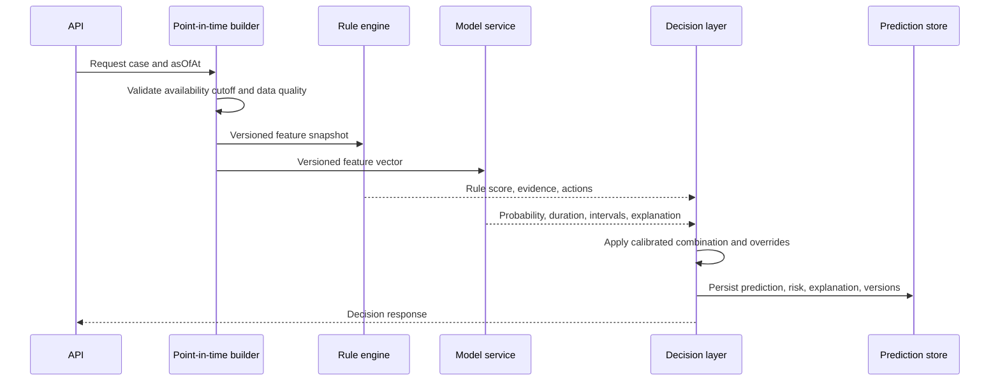

# Predictive Analytics Engine

The engine has two independent signal layers and one governed decision layer:

```text
point-in-time features
        |----------------------|
        v                      v
  rule evaluator          calibrated ML models
        |                      |
        +----------+-----------+
                   v
          policy decision layer
                   |
          risk, explanation, alert
```

The rules remain visible and auditable. The ML model estimates historical
probability and duration. The decision layer combines them without pretending that
an arbitrary weighted average is a calibrated probability.

## 1. Layer 1: rule-based early warning

Rules evaluate point-in-time features from the same feature snapshot used by ML.
Each rule returns a normalized contribution in `[0, 1]`, evidence, severity, and a
recommended action. A rule does not directly mutate a case or make a statutory
decision.

### Rule catalogue

| Rule | Trigger | Contribution rationale | Typical action |
|---|---|---|---|
| `MILESTONE_OVERDUE` | An open milestone is past `planned_at` | Direct schedule breach; contribution grows with overdue age | Assign milestone owner and escalate |
| `STAGE_AGING` | Active stage age exceeds its configured baseline | Detects stagnation relative to stage type, not a universal arbitrary day count | Review stage bottleneck |
| `PENDING_APPROVAL` | Required approval remains pending near or past its deadline | Identifies a controllable administrative queue | Escalate approval owner |
| `OBJECTION_VOLUME` | Open objections exceed a stage/project-type baseline | Signals unresolved stakeholder work | Schedule review/hearing |
| `OWNERSHIP_UNRESOLVED` | Title, mutation, or ownership verification remains unresolved | Blocks reliable acquisition and compensation | Assign records/legal review |
| `COMPENSATION_PENDING` | Approved or assessed compensation remains unpaid beyond policy window | Financial completion dependency is open | Finance/payment escalation |
| `LEGAL_DISPUTE` | Open legal case or active stay order exists | Legal constraint can halt progress | Legal review; critical override for stay |
| `DOCUMENT_GAP` | Required, rejected, expired, or unverified documents remain | Missing evidence blocks downstream stages | Complete document checklist |
| `MILESTONE_SLIPPAGE` | Multiple prior milestones missed or rescheduled | Repeated slippage is stronger than one isolated miss | Project-level corrective plan |

### Rule score calculation

Rules are not assigned arbitrary points. Each rule has a policy-controlled
`severity_function` and a `historical_lift` value:

```text
raw_rule_risk = 1 - product(1 - rule_i.contribution)
```

This noisy-OR form prevents independent warnings from simply adding beyond 1 and
reflects increasing concern when several distinct bottlenecks coexist. Correlated
rules are grouped so the same underlying issue is not counted repeatedly:

```text
administrative = max(PENDING_APPROVAL, MILESTONE_OVERDUE)
legal          = max(LEGAL_DISPUTE, OWNERSHIP_UNRESOLVED)
readiness      = max(DOCUMENT_GAP, COMPENSATION_PENDING)
schedule       = max(STAGE_AGING, MILESTONE_SLIPPAGE)
rule_score     = 1 - product(1 - group_score)
```

The contribution is calibrated from historical outcome rates where sufficient data
exists. Before that evidence exists, a rule may use a documented policy severity,
but it must be labelled `POLICY_RULE` and its outputs must not be described as
empirical probabilities.

### Example severity functions

The exact thresholds are configuration, not hardcoded statistics:

```text
milestone_overdue_contribution = sigmoid(
    (overdue_days - configured_tolerance_days) / configured_scale
)

stage_aging_contribution = sigmoid(
    (days_in_stage / historical_p75_stage_days) - 1
)

objection_contribution = min(
    1,
    open_objection_count / configured_review_threshold
)
```

Use a hard contribution of `1.0` only for a governed hard-stop condition, such as a
confirmed stay order where policy requires critical escalation. Every rule output
includes the measured value, threshold, policy version, and evidence timestamps.

## 2. Layer 2: machine-learning prediction

The ML layer receives the point-in-time feature vector and returns:

```text
delay_probability       calibrated P(significant delay within horizon)
expected_delay_days     expected remaining delay, conditional policy documented
lower_delay_days        lower uncertainty bound
upper_delay_days        upper uncertainty bound
ml_risk_band            model probability band before rule overrides
```

### Probability calibration

Raw classifier scores are not treated as probabilities. On a time-ordered validation
set, compare:

- Platt scaling for compact datasets and near-logistic score behaviour.
- Isotonic regression when enough validation data supports a flexible mapping.
- Beta calibration when sigmoid calibration is systematically asymmetric.

Select calibration by validation Brier score, reliability curve, and calibration
stability across time and districts. Fit the calibrator only on the validation
portion, never on the final test set. Store calibration method and calibration
model version with the deployed model.

### Duration prediction

Use one of two defensible designs:

1. A two-stage model: classifier predicts delay probability; a duration model
   predicts remaining days conditional on delay. The expected value is probability
   times conditional duration when an unconditional expectation is required.
2. A survival/time-to-event model that handles active cases as right-censored and
   returns a survival curve, median remaining time, and prediction interval.

For an operational prototype, use calibrated classification plus a survival model
as the primary duration approach, with a regression baseline for comparison. Do not
assign a completed duration to an active case.

## 3. Final decision layer

The final layer must preserve distinct quantities:

```text
ml_probability       = calibrated ML estimate
rule_score           = operational warning score
urgency_modifier     = policy metadata, not a probability
milestone_state      = explicit workflow state and evidence
final_risk_level     = governed classification decision
```

Do not claim that a weighted combination is a probability unless it has itself been
calibrated against outcomes. Two supported approaches are:

### Preferred policy-gated combination

1. Start with calibrated `ml_probability`.
2. Use `rule_score` as an independent operational signal.
3. Apply a small, documented policy adjustment only where rules expose information
   that the model intentionally excludes or where immediate action is required.
4. Recalibrate the resulting score on historical validation data if it is exposed
   as a probability.
5. Keep the original ML probability and rule score in the response.

Conceptually:

```text
combined_score = calibrate(
    logit(ml_probability) + policy_coefficient * logit(rule_score)
)
```

`policy_coefficient` is learned or approved using validation outcomes; it is not
chosen because it makes a demo look plausible. If insufficient outcomes exist,
omit this numerical combination and use ML probability for probability reporting,
while using rules only for escalation and risk classification.

### Risk classification policy

1. Calculate calibrated ML probability and rule score.
2. Determine the configured probability band.
3. Apply deterministic overrides only for explicit, versioned conditions.
4. Record whether an override occurred and why.

Example starting bands:

| Risk level | Calibrated probability | Rule/urgency override |
|---|---:|---|
| LOW | `< 0.25` | No active material warning |
| MEDIUM | `0.25` to `< 0.50` | One material warning or approaching deadline |
| HIGH | `0.50` to `< 0.75` | Multiple warnings or serious slippage |
| CRITICAL | `>= 0.75` | Confirmed stay, statutory breach, or hard-stop policy |

These are starting policy thresholds. Thresholds must be optimized against recall,
precision, intervention capacity, and the cost of missed critical cases. The final
level is not presented as a statistical fact when it was produced by a rule override.

## 4. Prediction API contract

### Request

```http
POST /api/v1/cases/{caseId}/predictions
```

```json
{
  "asOfAt": "2026-09-15T09:30:00Z",
  "horizonDays": 90,
  "mode": "CURRENT",
  "forceRefresh": false
}
```

`asOfAt` defaults to the server time for live inference. Backdated requests are
restricted to authorized analysis roles and must not use facts recorded after that
timestamp.

### Response

```json
{
  "caseId": "case-uuid",
  "projectId": "project-uuid",
  "asOfAt": "2026-09-15T09:30:00Z",
  "horizonDays": 90,
  "delayProbability": 0.82,
  "expectedDelayDays": 47,
  "delayInterval": { "lowerDays": 29, "upperDays": 76 },
  "riskLevel": "HIGH",
  "confidence": 0.89,
  "mlProbability": 0.78,
  "ruleScore": 0.86,
  "ruleOverrides": [],
  "topRiskFactors": [],
  "recommendedActions": [],
  "model": {
    "modelVersion": "delay-xgb-2026-09-01",
    "calibrationVersion": "isotonic-2026-09-01",
    "featureVersion": "case-features-v3",
    "policyVersion": "risk-policy-v2"
  },
  "dataQuality": {
    "dataOrigin": "SYNTHETIC_DEMO",
    "missingFeatureCount": 2,
    "staleFeatureCount": 0,
    "warnings": []
  },
  "generatedAt": "2026-09-15T09:30:02Z"
}
```

The numeric values above are response-shape examples only. Production values are
computed from the snapshot and deployed artefacts; they are never hardcoded.

### Explanation object

Each `topRiskFactors` item should contain:

```json
{
  "factorCode": "MISSING_DOCUMENT_COUNT",
  "label": "Required documents are missing",
  "currentValue": 4,
  "comparisonValue": 1.2,
  "direction": "INCREASES_RISK",
  "contribution": 0.19,
  "source": "ML_AND_RULE",
  "evidenceAt": "2026-09-15T09:00:00Z",
  "explanation": "Four required documents remain unverified."
}
```

ML contributions come from the deployed model explanation method. Rule factors use
the rule evidence and severity. The explanation service must not invent causal
language; it should say “contributed to the prediction”, not “caused the delay”.

## 5. Confidence score

`confidence` is not the same as delay probability. It describes how reliable the
prediction is under the available evidence.

Recommended components:

- Calibration reliability in the relevant probability band.
- Prediction interval width for duration.
- Feature completeness and freshness.
- Similarity to the training population.
- Model agreement across an ensemble or repeated folds.
- Historical validation support for the district/project type.

One defensible implementation is a separately validated confidence model or a
calibrated reliability score:

```text
confidence = calibrated_reliability(
    interval_width,
    missingness,
    drift_distance,
    population_support,
    calibration_error_band
)
```

Until enough validation data exists, return a labelled `confidence_band` such as
`HIGH`, `MEDIUM`, or `LOW` instead of a pseudo-precise decimal. Never expose `0.89`
merely because the input model probability is `0.82`.

## 6. Feature and inference pipeline



### Inference steps

1. Authorize case and geographic scope.
2. Resolve `as_of_at` and prediction horizon.
3. Build or retrieve an immutable feature snapshot.
4. Reject or downgrade predictions if required inputs are stale or unavailable.
5. Evaluate all active rules and collect evidence.
6. Load the approved champion model and calibrator.
7. Generate probability, duration, interval, and local explanation.
8. Combine outputs under the active policy version.
9. Generate recommendations from rule evidence and model factors.
10. Persist the full result before returning it.

## 7. Storage and history

The existing tables support immutable prediction history:

- `predictions`: every ML inference, input snapshot, duration interval, and explanation.
- `prediction_explanations`: one immutable explanation envelope per prediction,
  including method, baseline, confidence, and limitations.
- `prediction_factors`: ranked local factors with signed contribution, direction,
  display text, evidence time, and optional rule linkage.
- `model_feature_importance`: global SHAP/permutation/coefficients by model and cohort.
- `prediction_recommendations`: ordered actions linked to a specific prediction.
- `risk_assessments`: every rule, ML, combined, or manual risk decision.
- `rule_evaluations`: every rule trigger, contribution, threshold, evidence, and action.
- `model_versions`: model artifacts, metrics, calibration, approval, and deployment state.
- `risk_policies`: versioned thresholds, overrides, and rule configuration.
- `alerts`: warnings created from threshold crossings or hard rules.
- `recommendations`: actions and their operational outcomes.
- `ml_case_feature_snapshots`: reproducible feature inputs.
- `historical_events`: case timeline and intervention events.
- `audit_logs`: actor, request, old values, and new values.

Never overwrite a prediction. The current result is the latest valid prediction for
the requested horizon, while historical results remain available for trend analysis
and model evaluation. Store a prediction fingerprint from case, cutoff, horizon,
feature version, model version, and policy version to support idempotent retries.

## 8. Model registry and versioning

Every deployed model must have:

- Unique model version and model family.
- Training data window and row count.
- Feature version and label policy version.
- Calibration method/version.
- Hyperparameters and artifact checksum.
- Validation and test metrics.
- Subgroup metrics and drift baseline.
- Approval status, approver, creation time, and retirement time.
- Rollback predecessor.

Deployment states should be `CANDIDATE`, `SHADOW`, `CHAMPION`, `RETIRED`, and
`REJECTED`. A candidate first runs in shadow mode, where its predictions are logged
but do not affect officials, alerts, or risk levels. Promote it only after temporal
and subgroup evaluation. Keep the prior champion available for rollback.

## 9. Retraining lifecycle

1. Ingest newly completed outcomes and validate labels.
2. Freeze a point-in-time training window and label policy.
3. Rebuild features with the same historical availability rules.
4. Run leakage checks and compare data coverage with the previous release.
5. Train baseline, champion, and challenger models.
6. Calibrate probabilities on a time-separated validation block.
7. Evaluate delay, duration, calibration, subgroup, and operational metrics.
8. Register artifacts and metadata.
9. Run shadow predictions against live traffic.
10. Obtain model governance approval.
11. Promote or reject, then monitor post-deployment performance.

Retraining can be scheduled quarterly or triggered by drift, outcome volume, or
calibration degradation. Do not retrain solely because a dashboard metric moved for
one short period. Synthetic/demo data can test the pipeline but must be identified
and kept separate from official model claims.

## 10. Defensive failure behaviour

If the model service is unavailable, return the last valid prediction with its age
and mark the response `predictionStatus = STALE`, while the rule engine continues to
generate operational warnings. If essential data is missing, do not silently impute
everything and report high confidence; return a lower confidence band and data-quality
warnings. If the model version or feature version is unavailable, fail closed for ML
and use a clearly labelled rule-only risk result.